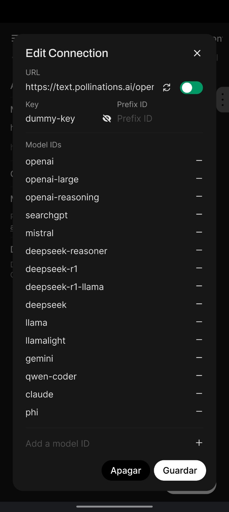

# How to Add **Pollinations AI Text Models** to **OpenWebUI**  
_Access top language models for free_

## What is Pollinations AI?

[Pollinations AI](https://pollinations.ai) is an open-source gen AI startup from Berlin offering free, easy-to-use text and image generation APIs. No signups or API keys required, with zero data storage and completely anonymous usage. Access powerful models like **GPT-4o**, **Mistral**, **Claude**, and **Gemini** instantly.

> **Note for Image Generation**: For image generation with Pollinations AI, install [this tool in OpenWebUI](https://openwebui.com/t/kaneki/image_generation) to handle image generation automatically.

## Quick Setup

### 1. In OpenWebUI, go to **Settings > Admin > Connections**
- Click **"Add Connection"** under OpenAI API connections

### 2. Configure as follows:
| Field | Value |
|-------|-------|
| **URL** | `https://text.pollinations.ai/openai` |
| **Key** | `dummy-key` (any text works) |
| **Model IDs** | Add models from the list below |

### 3. Click **"Save"** to add the models to OpenWebUI

## Available Models

| Model ID           | Description                  |
|--------------------|------------------------------|
| `openai-large`     | GPT-4o                       |
| `openai`           | GPT-4o-mini                 |
| `openai-reasoning` | o3-mini (Reasoning)         |
| `searchgpt`        | SearchGPT (web search req.) |
| `mistral`          | Mistral 3.1 (Vision)        |
| `deepseek-r1`      | DeepSeek R1-Qwen (Reasoning)|
| `deepseek-r1-llama`| DeepSeek R1-Llama 70B       |
| `llama`            | Llama 3.3 70B              |
| `llamalight`       | Llama 3.1 8B               |
| `gemini`           | Gemini 2.0 Flash           |
| `qwen-coder`       | Qwen 2.5 Coder 32B         |
| `claude`           | Claude 3.5 Haiku           |
| `phi`              | Phi-4 Instruct             |

> 📌 Full model list available at: **https://text.pollinations.ai/models**

### Known Limitations
- Models "unity" and "midijourney" are unsupported in OpenWebUI.
- DeepSeek models (´deepseek´, ´deekseek-reasoner´) may return "500: API error: 402 Payment Required."

Connection example

## Support the Project
If you find this useful, consider sponsoring Pollinations:  
👉 **https://github.com/pollinations/pollinations**

Your support helps keep AI free and accessible to all.
