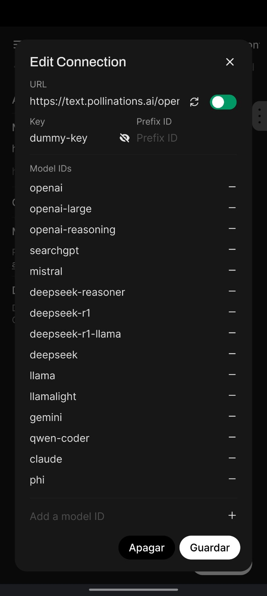

# How to Add **Pollinations AI Text Models** to **OpenWebUI**  
_Access top language models for free_

## What is Pollinations AI?

[Pollinations AI](https://pollinations.ai) offers free, easy-to-use text and image generation APIs. No signups or API keys required, with zero data storage and completely anonymous usage. Access powerful models like **GPT-4o**, **Mistral**, **Claude**, and **Gemini** instantly.

> **Note for Image Generation**: For image generation with Pollinations AI, install [this tool](https://openwebui.com/t/kaneki/image_generation) or [this tool](https://openwebui.com/t/kuanjames/pollinations) in OpenWebUI.
> 
> **Function Pipe**: For easier access to Pollinations' OpenAI models specifically, use [this function pipe I created](https://openwebui.com/f/kastru/openai_models).

## Quick Setup
1. In OpenWebUI go to **Settings > Admin > Connections** → **Add Connection** under OpenAI API.
2. Enter:
   - **URL:** `https://text.pollinations.ai/openai`
   - **Key:** `dummy-key`
   - **Model IDs:** choose from the list
3. Click **Save**.

## List Models
```bash
curl https://text.pollinations.ai/models
curl https://text.pollinations.ai/openai/models
```
> Some models (e.g. MidJourney or Unity) aren’t supported in OpenWebUI and availability may change. Run the list command to see current models.

You can also paste these commands into a web-based curl client like [ReqBin](https://reqbin.com/curl).

<details>
<summary>Connection example</summary>


</details>

## Support the Project
If you find this useful, consider sponsoring Pollinations:  
👉 **https://github.com/pollinations/pollinations**

Your support helps keep AI free and accessible to all.
